# Titan — Abhängigkeiten (Mindmap)

> Visualisiert die Abhängigkeiten aller Konzept-Bausteine. Quelle der Wahrheit ist dieses
> Mermaid-Diagramm (versionierbar, rendert in GitHub/IDE/Artifact). Konzept:
> [gesamtkonzept-lernprozess.md](gesamtkonzept-lernprozess.md). **Pfeil A → B = „A wird für B
> gebraucht" (A ist Voraussetzung).** Gepunktet = querschnittlich (misst/testet).

**Legende (Farben):** 🟩 LIVE · 🟨 Content/Redaktion · 🟦 KI Phase 3 · 🟪 Phase 4 (USP/Kosmos) · ⬜ Global · 🟧 Prinzip

```mermaid
graph TD
  KOMPASS["⭐ Design-Kompass<br/>begründete Entscheidung"]

  subgraph FUND["Fundament — LIVE ✅"]
    ENGINE["Modul-Engine + 7 Werkzeuge → Artefakte"]
    DECK0["Deck-Aggregator (Vorstufe)"]
    AUTH["Auth + DB + Progress-Sync"]
    COSMOS["Dunkler Kosmos (Seiten 1–3)"]
    GATE["Login-Gate"]
  end

  subgraph CONTENT["Content & Redaktion"]
    PDFS["Fachwirt-PDFs"]
    DIRECTUS["Directus (Redaktion)"]
    LOADER["Astro-Loader + Zod"]
    DEPLOY["Auto-Deploy (Webhook→Build)"]
  end

  subgraph UEBUNG["Übungswelten"]
    MCA["Stufe A: MC + Selbstcheck"]
    FREIB["Stufe B: Freitext + Varianz"]
  end

  subgraph KIP["KI — Phase 3 (n8n + Claude)"]
    KTX["Kontext-JSON (Deklination)"]
    FEED["Formatives Feedback"]
    FG["Fachgespräch-Simulator"]
    RECAST["Fall-Recast / Varianz"]
    N8N["n8n Agenten-Teams + Personalakte"]
    GUARD["Guardrails + Kosten-Gate"]
    EU["EU-Pfad: Anthropic→Langdock→Soofi"]
  end

  subgraph LAUNCHG["Missions-Launch — USP (Phase 4)"]
    ANKER["Themen-Anker"]
    BOEGEN["4 Spannungsbögen"]
    KRIT["9 Bewertungskriterien"]
    VIELFALT["Vielfalt: Templates×Farbwelten"]
    EXPORT["PDF-Export + Zustände"]
    DECKGEN["Deck-Generator"]
  end

  subgraph SAT["HB-Satellit (Trainingsraum)"]
    SATELLIT["Satellit + Kennzahlen"]
    PROBE["Probe-Startrampe"]
    HSIM["HB-Prüfungssim"]
  end

  subgraph UIK["Kosmos / UI"]
    LREADY["Launch-Bereitschaft (Energie-Ring)"]
    P42["Phase 4.2: NASA-WebGL (three.js)"]
  end

  subgraph GLOB["Global"]
    SPACED["Spaced-Repetition / Prüfungsdatum"]
    LANDING["Landingpage + Paywall"]
    PAY["Payments (Stripe)"]
    LOAD["Lastentest"]
    QA["Agenten-QA"]
  end

  ENGINE --> DECK0
  PDFS --> DIRECTUS
  DIRECTUS --> LOADER
  LOADER --> DEPLOY
  DEPLOY --> MCA
  DEPLOY --> FREIB
  KTX --> FEED
  GUARD --> FEED
  EU --> FEED
  FEED --> FG
  N8N --> RECAST
  FEED --> RECAST
  RECAST --> FREIB
  ENGINE --> DECKGEN
  ANKER --> DECKGEN
  BOEGEN --> DECKGEN
  KRIT --> DECKGEN
  VIELFALT --> DECKGEN
  EXPORT --> DECKGEN
  FEED --> DECKGEN
  FG --> DECKGEN
  DECKGEN --> PROBE
  ENGINE --> SATELLIT
  HSIM --> SATELLIT
  SPACED --> SATELLIT
  ENGINE --> LREADY
  P42 --> LREADY
  P42 --> COSMOS
  P42 --> SATELLIT
  LANDING --> GATE
  DECKGEN --> PAY
  KOMPASS -.-> DECKGEN
  QA -.-> DECKGEN
  LOAD -.-> AUTH
  LOAD -.-> N8N

  classDef live fill:#14532d,stroke:#3fbf8f,color:#eafff5;
  classDef content fill:#3a2f14,stroke:#e0b84a,color:#fff;
  classDef p3 fill:#1e2a4a,stroke:#7d93d6,color:#fff;
  classDef p4 fill:#3a1e3a,stroke:#c078c0,color:#fff;
  classDef glob fill:#2a2a30,stroke:#9a9aa8,color:#fff;
  classDef principle fill:#4a2f0a,stroke:#e0a040,color:#fff;

  class ENGINE,DECK0,AUTH,COSMOS,GATE live;
  class PDFS,DIRECTUS,LOADER,DEPLOY,MCA content;
  class FREIB,KTX,FEED,FG,RECAST,N8N,GUARD,EU p3;
  class ANKER,BOEGEN,KRIT,VIELFALT,EXPORT,DECKGEN,SATELLIT,PROBE,HSIM,LREADY,P42,SPACED,PAY p4;
  class LANDING,LOAD,QA glob;
  class KOMPASS principle;
```

## Kritische Pfade (Kurzlesung)

- **Content-Kette:** `PDFs → Directus → Loader+Zod → Auto-Deploy → Übungen (MC)`.
- **KI-Kette (Phase 3):** `Kontext-JSON → Feedback → Fachgespräch`; `n8n + Feedback → Fall-Recast → Freitext-Übungen (Stufe B)`.
- **USP-Kette:** `Artefakte + Bögen + Kriterien + Vielfalt + Export → Deck-Generator → Probe-Startrampe / Payments`.
- **Kosmos:** `Phase 4.2 (NASA-WebGL)` hebt Kosmos, Satellit-Orbit und Launch-Bereitschaft aufs Zielniveau.
- **Querschnitt:** Design-Kompass **misst** alles; Agenten-QA **testet**; Lastentest **vor** Launch.
